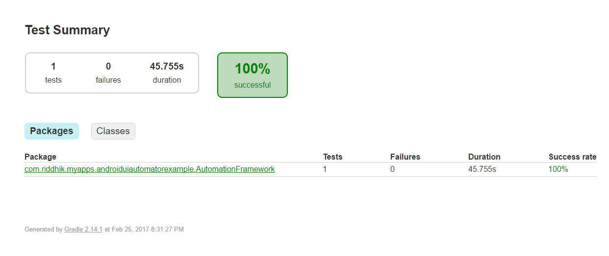

# Android UiAutomator Framework

## eBay app search script using Android UiAutomator tool

## Test Script:
#### Step1: Uninstall app if already installed
#### Step2: Open Play Store app and download eBay app
#### Step3: Launch eBay app
#### Step4: Select search box on eBay app and search for product
#### Step5: Check search results returned for product

## Execution:
#### Execute the app from Gradle task
##### Steps: Select Gradle tab from Android Studio-> Select App -> Select Tasks -> Select verification
Run connectedAndroidTest gradle task

## Report:
#### Open path_to_folder\AndroidUiAutomatorFramework\app\build\reports\androidTests\connected folder after execution of the tests.
#### Open index.html file to see execution report

